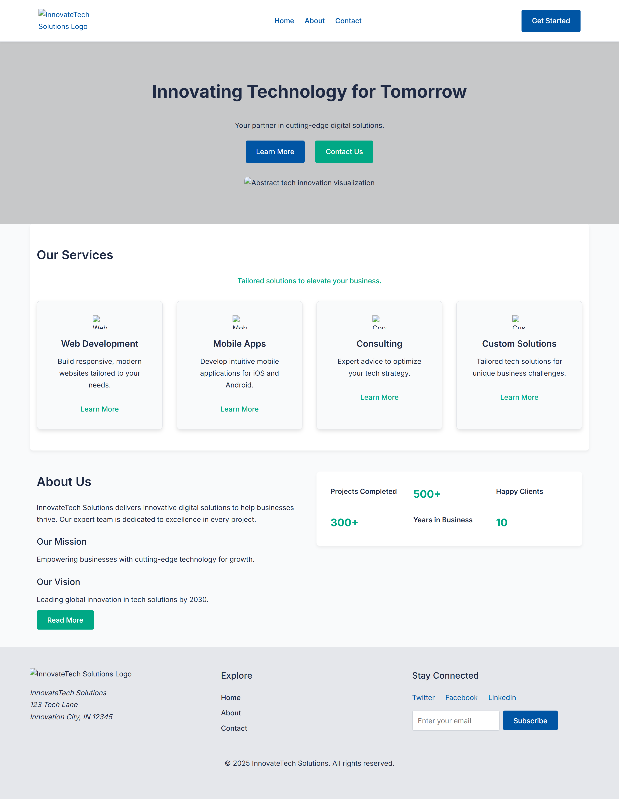
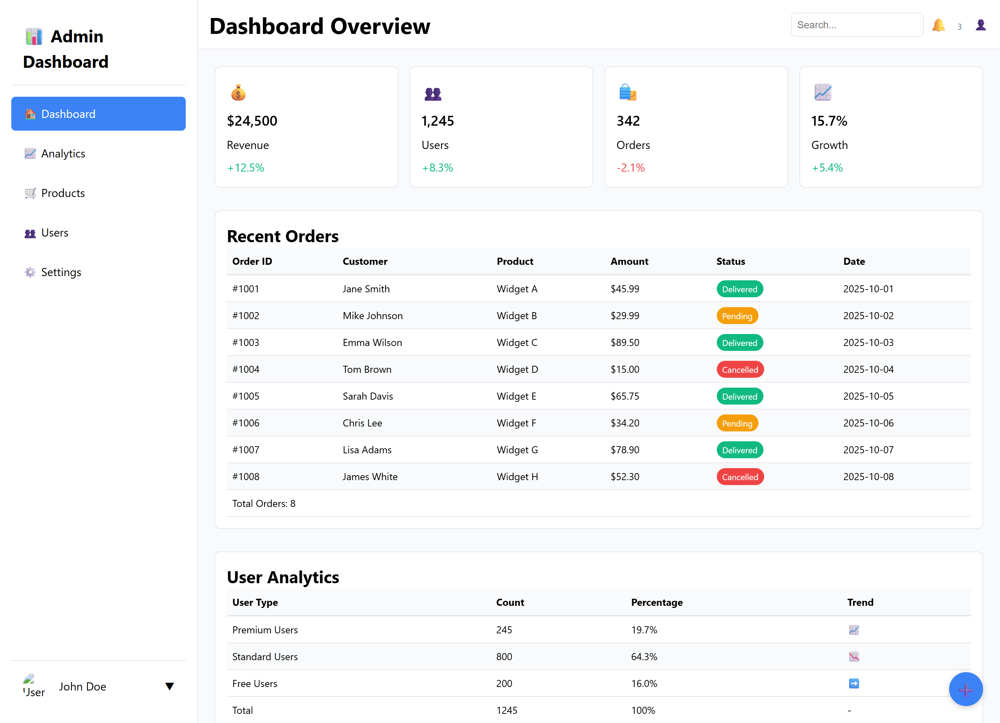
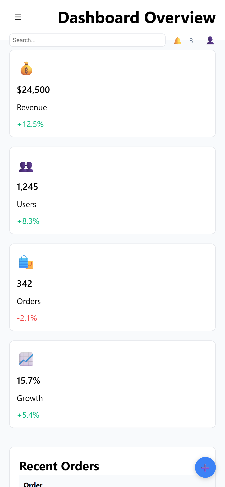

# HTML & CSS Comprehensive Assignment

## 📘 Overview
This repository contains solutions for the **HTML & CSS Comprehensive Assignment**, demonstrating proficiency in **semantic HTML5**, **modern CSS3**, **responsive design**, and **accessibility best practices**.

---

## 📂 Project Structure
```plaintext
html-css-comprehensive-assignment/
├── README.md
├── question1-innovatetech/
│   ├── index.html
│   ├── about.html
│   ├── contact.html
│   ├── css/
│   │   └── styles.css
│   └── images/
├── question2-dashboard/
│   ├── dashboard.html
│   ├── css/
│   │   └── dashboard.css
│   └── images/
└── screenshots/
```

---

## 🖥️ Question 1: InnovateTech Solutions Website
A **responsive company website** built using **HTML5** and **CSS3**, showcasing:
- Semantic structure with header, nav, main, and footer  
- Responsive layout using **Flexbox** and **Grid**  
- CSS-only hamburger menu  
- Accessible and validated contact form  
- Mobile-first design with breakpoints at 768px and 1024px  

---

## 📊 Question 2: Admin Dashboard Application
A **modern responsive dashboard** designed with **CSS Grid**, **Flexbox**, and **custom properties**, featuring:
- Sidebar navigation and header bar  
- Statistics cards and data tables  
- Product form with styled inputs and validation  
- Hover, active, and responsive states using pure CSS  

---

## ♿ Accessibility & Compatibility
- Proper alt texts, labels, and fieldsets  
- Logical heading hierarchy and color contrast  
- Tested on Chrome, Firefox and Edge

---

## 📸 Screenshots
| Project | Desktop | Mobile |
|----------|----------|---------|
| InnovateTech Website |  |  |
| Dashboard Application |  |  |

---

## ✅ Technologies Used
- HTML5  
- CSS3  
- Flexbox  
- CSS Grid  
- Responsive Design

---

**Author:** *GC*  
**Assignment:** HTML & CSS Comprehensive Assignment
